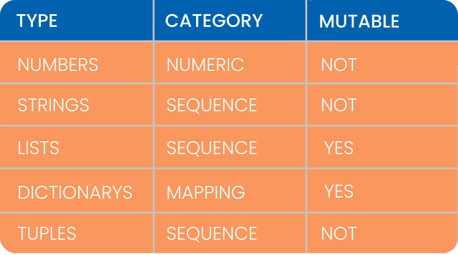
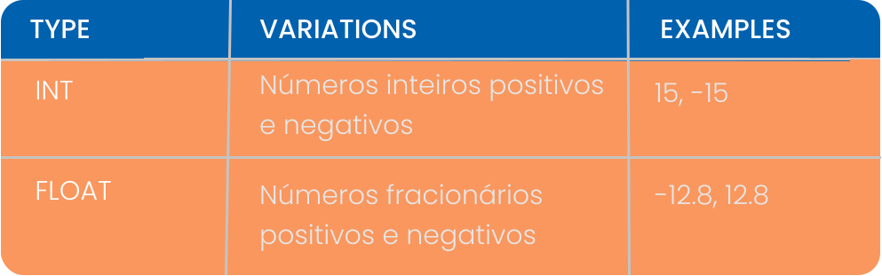
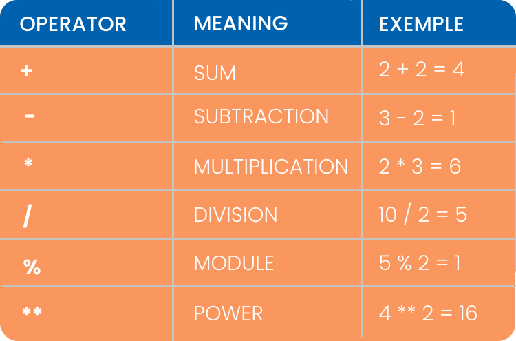

<h1
  align='center'
>
  <a
    href="https://www.datascienceacademy.com.br/"
  >
    
  </a>

  <h2
    align="center"
  >
    Python Fundamentos para Análise de Dados
  </h2>

  <h3
    align="center"
  >
    
  </h3>

  <h2
    align="center"
  >
    VARIÁVEIS, TIPOS E ESTRUTURAS DE DADOS
  </h2>

</h1>

<br
/>

<h3
  align="center"
>
  <a
    href="#NÚMEROS"
  >
    
  </a>
  <br
  />
  <a
    href="#VARIÁVEIS"
  >
    
  </a>
  <br
  />
  <a
    href="#STRINGS"
  >
    
  </a>
  <br
  />
  <a
    href="#LISTAS"
  >
    
  </a>
  <br
  />
  <a
    href="#DICIONÁRIOS"
  >
    
  </a>
  <br
  />
  <a
    href="#TÚPLAS"
  >
    
  </a>
  <br
  />
  <a
    href="#EXERCÍCIOS"
  >
    
  </a>
  <br
  />
  <a
    href="#GAME"
  >
    
  </a>
</h3>

<br
/>

## NÚMEROS

### TIPOS NÚMERICOS

<p
  align="capitalize"
>
  Existem dois tipos númericos principais em Python:
</p>

<h3
  align="capitalize"
>
  
</h3>

### OPERAÇÕES MATEMÁTICAS

<p
  align="capitalize"
>
  O python como todas as linguagens de programação tem todas as operações e funções matemáticas e também podem ser utilizados como uma calculadora avançada.
</p>

<h3
  align="capitalize"
>
  
</h3>

<p
  align="capitalize"
>
  Para realizar essas operações com números inteiros com números positivos e negativos é como na matemática convencional, mas dentro das regras da linguagem Python.

  Soma:
</p>

```Python
8 + 12
```

```Python
7 - 7
```

<p
  align="capitalize"
>
  Subtração:
</p>

```Python
5.2 + 1200.8
```

```Python
-3.1 - 7.9999
```

<p
  align="capitalize"
>
  Multiplicação:
</p>

```Python
7.4 ** 2
```

```Python
5 ** 3
```

<p
  align="capitalize"
>
  Divisão:
</p>

```Python
7.4 ** 2
```

```Python
5 ** 3
```

<p
  align="capitalize"
>
  Módulo:
</p>

```Python
49 % 2
```

```Python
25 % 3
```

<p
  align="capitalize"
>
  Potência:
</p>

```Python
5 ** 5
```

```Python
7 ** 8
```

<p
  align="capitalize"
>
  Também podemos utilizar números com pontos flutuante(float) para realizar as mesmas operações.
</p>


```Python
# Soma
6.7 + 8.3 + 5
```

```Python
# Subtração
10.2 - 9.1
```

```Python
# Multiplicação
8.7 * 8.7
```

<p
  align="capitalize"
>
  Na divisão ainda podemos utilizar ooperador de <strong>divisão inteira</strong> com <strong>//</strong>
</p>

```Python
15.3 / 3 # Divisão
49.9 // 3 # Divisão Inteira
```

### FUNÇÕES BUILT-IN

<p
  align="capitalize"
>
  <strong
  >
    Funções Built-in
  </strong>
  ou no Português Funções Internas, são funções já incorporadas na própria linguagem sem necessidade de importações ou implementações avançadas.
</p>

#### TIPO DE UMA VARIÁVEL

<p
  align="capitalize"
>
  Para sabermos o tipo de um dado em uma variável podemos utilizar o <strong>type()</strong>
</p>

```python
 type(5.8)
```

```python
 type(-8)
```

<p
  align="capitalize"
>
  Também podemos utilizar o <strong>TYPE</strong> para outros tipos de dados.
</p>

```python
 # Variável do tipo String
 name = 'Armando'
 type(name)
```

#### CONVERSÃO

<p
  align="capitalize"
>
  Podemos utilizar funções <strong>built-in</strong> como o <strong>int()</strong> para converter números para um tipo inteiro ou <strong>float()</strong> para converter para um número com ponto flutuante.
</p>

```python
 int(5.4)
```

```python
 int(-8.4)
```

```python
 float(125)
```

#### HEXADECIMAL E BINÁRIO

<p
  align="capitalize"
>
  Com as funções <strong>hex</strong> podemos converter números inteiros para o padrão hexadecimal. <strong>Hexadecimal</strong> é um sistema de numeração posicional que representa os números em base 16, ou seja, utilizando 16 símbolos.
</p>

```python
 hex(3900)
```

```python
 hex(10)
```

<p
  align="capitalize"
>
  Com a função <strong>bin</strong> podemos converter números inteiros em binário. O Sitema de Numeração <strong>Binário</strong> ou de base 2 é um sistema de numeração posicional em que todas as quantidades estão representadas com base em apenas dois números.
</p>

```python
 bin(23)
```

```python
 hex(7090)
```

<br
/>

## VARIÁVEIS

<br
/>

## STRINGS

<br
/>

## LISTAS

<br
/>

## DICIONÁRIOS

<br
/>

## TÚPLAS

<br
/>

## EXERCÍCIOS

<br
/>

## GAME

<br
/>
