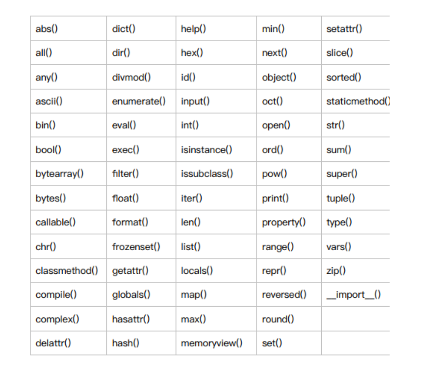
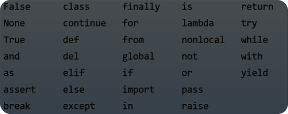

<h1
  align='center'
>
  <a
    href="https://www.datascienceacademy.com.br/"
  >
    
  </a>

  <h2
    align="center"
  >
    Python Fundamentos para Análise de Dados
  </h2>

  <h3
    align="center"
  >
    
  </h3>

  <h2
    align="center"
  >
    VARIÁVEIS, TIPOS E ESTRUTURAS DE DADOS
  </h2>

</h1>

<br
/>

<h3
  align="center"
>
  <a
    href="#NÚMEROS"
  >
    
  </a>
  <br
  />
  <a
    href="#VARIÁVEIS"
  >
    
  </a>
  <br
  />
  <a
    href="#STRINGS"
  >
    
  </a>
  <br
  />
  <a
    href="#LISTAS"
  >
    
  </a>
  <br
  />
  <a
    href="#DICIONÁRIOS"
  >
    
  </a>
  <br
  />
  <a
    href="#TÚPLAS"
  >
    
  </a>
  <br
  />
  <a
    href="#EXERCÍCIOS"
  >
    
  </a>
  <br
  />
  <a
    href="#GAME"
  >
    
  </a>
</h3>

<br
/>

## NÚMEROS

### TIPOS NÚMERICOS

<p
  align="capitalize"
>
  Existem dois tipos númericos principais em Python:
</p>

<h3
  align="capitalize"
>
  
</h3>

### OPERAÇÕES MATEMÁTICAS

<p
  align="capitalize"
>
  O python como todas as linguagens de programação tem todas as operações e funções matemáticas e também podem ser utilizados como uma calculadora avançada.
</p>

<h3
  align="capitalize"
>
  
</h3>

<p
  align="capitalize"
>
  Para realizar essas operações com números inteiros com números positivos e negativos é como na matemática convencional, mas dentro das regras da linguagem Python.

  Soma:
</p>

```Python
8 + 12
```

```Python
7 - 7
```

<p
  align="capitalize"
>
  Subtração:
</p>

```Python
5.2 + 1200.8
```

```Python
-3.1 - 7.9999
```

<p
  align="capitalize"
>
  Multiplicação:
</p>

```Python
7.4 ** 2
```

```Python
5 ** 3
```

<p
  align="capitalize"
>
  Divisão:
</p>

```Python
7.4 ** 2
```

```Python
5 ** 3
```

<p
  align="capitalize"
>
  Módulo:
</p>

```Python
49 % 2
```

```Python
25 % 3
```

<p
  align="capitalize"
>
  Potência:
</p>

```Python
5 ** 5
```

```Python
7 ** 8
```

<p
  align="capitalize"
>
  Também podemos utilizar números com pontos flutuante(float) para realizar as mesmas operações.
</p>


```Python
# Soma
6.7 + 8.3 + 5
```

```Python
# Subtração
10.2 - 9.1
```

```Python
# Multiplicação
8.7 * 8.7
```

<p
  align="capitalize"
>
  Na divisão ainda podemos utilizar ooperador de <strong>divisão inteira</strong> com <strong>//</strong>
</p>

```Python
15.3 / 3 # Divisão
49.9 // 3 # Divisão Inteira
```

### FUNÇÕES BUILT-IN

<p
  align="capitalize"
>
  <strong
  >
    Funções Built-in
  </strong>
  ou no Português Funções Internas, são funções já incorporadas na própria linguagem sem necessidade de importações ou implementações avançadas.
</p>

<h3
  align="capitalize"
>
  
</h3>

#### TIPO DE UMA VARIÁVEL

<p
  align="capitalize"
>
  Para sabermos o tipo de um dado em uma variável podemos utilizar o <strong>type()</strong>
</p>

```python
 type(5.8)
```

```python
 type(-8)
```

<p
  align="capitalize"
>
  Também podemos utilizar o <strong>TYPE</strong> para outros tipos de dados.
</p>

```python
 # Variável do tipo String
 name = 'Armando'
 type(name)
```

#### CONVERSÃO

<p
  align="capitalize"
>
  Podemos utilizar funções <strong>built-in</strong> como o <strong>int()</strong> para converter números para um tipo inteiro ou <strong>float()</strong> para converter para um número com ponto flutuante.
</p>

```python
 int(5.4)
```

```python
 int(-8.4)
```

```python
 float(125)
```

#### HEXADECIMAL E BINÁRIO

<p
  align="capitalize"
>
  Com as funções <strong>hex</strong> podemos converter números inteiros para o padrão hexadecimal. <strong>Hexadecimal</strong> é um sistema de numeração posicional que representa os números em base 16, ou seja, utilizando 16 símbolos.
</p>

```python
 hex(3900)
```

```python
 hex(10)
```

<p
  align="capitalize"
>
  Com a função <strong>bin</strong> podemos converter números inteiros em binário. O Sitema de Numeração <strong>Binário</strong> ou de base 2 é um sistema de numeração posicional em que todas as quantidades estão representadas com base em apenas dois números.
</p>

```python
 bin(23)
```

```python
 hex(7090)
```

<br
/>

## VARIÁVEIS

<p
  align="capitalize"
>
  Uma
  <a
    href="https://realpython.com/python-variables/"
  >
    Variável
  </a>
  é como um nome anexado a um objeto específico. No Python, as variáveis não precisam ser declaradas ou definidas com antecedência, como é o caso em muitas outras linguagens de programação. Para criar uma variável, basta atribuir um valor e começar a usá-lo. A atribuição é feita com um único sinal de igual (=).
</p>
<br
/>

```python
 teste = 1
```

<p
  align="capitalize"
>
  O valor pode ser impresso na tela utilizando a função built-in
  <strong
  >
    print()
  </strong>
</p>

```python
 print(teste)
```

<p
  align="capitalize"
>
  Podemos alterar o valor dessa variável, assim como exibilo em uma prompt intérprete em uma sessão REPL(Read–eval–print loop) sem a necessidade de <strong>print()</strong>.
</p>

```python
 teste = 1000
 teste
```

<p
  align="capitalize"
>
  Também é possível fazer declarações multiplas de variáveis, seja esse a um mesmo valor, como a valores diferentes.
</p>

```python
 x, y, z = 153
 x, y, z = 100, 50, 3
```

<p
  align="capitalize"
>
  Em muitas linguagens de programação, as variáveis são digitadas estaticamente, como tendo inicialmente um tipo de dados específico, e qualquer valor atribuído a ela durante sua vida útil tem sempre esse tipo de valor. No Python as variáveis não estão sujeitas a esta restrição. Aqui uma variável pode receber um valor de um tipo e, posteriormente, reatribuir um valor de um tipo diferente.
</p>

```python
  example = 22.37
  print(example)
  # 22.37

  example = 'Eu sou groot!'
  print(example)
  # Eu sou groot!
```

<p
  align="capitalize"
>
  As variáveis em Python podem ser escritas com letras, números e underline, mas não podem começar com números.
</p>

```python
 name01 = 'Coffee'
 numbers = 12321
```

<p
  align="capitalize"
>
  O python é <a href="https://pt.wikipedia.org/wiki/Case-sensitive">case-sensitive</a> o que significa que as palavras depois da primeira são capitalizadas. Não se limitando a isso, assim como na maioria das linguagens de programação, podemos utilizar <strong>Snake Case</strong> ou <strong>Pascal Case</strong> na hora de escrever suas variáveis.
</p>

```python
 MyName = 'Armando Silva'
 myName = 'Armando Silva'
 my_name = 'Armando Silva'
```

<p
  align="capitalize"
>
  As palavras reservadas em Python, nomes de funções especias no idioma. Até o Python 3.6 eram 33 palavras reservadas.
</p>

<h3
  align="capitalize"
>
  
</h3>

<p
  align="capitalize"
>
  Essas palavras não podem ser usadas como nome de variáveis.
</p>

```python
 and = 'Let is go'
 # SyntaxError: sintaxe inválida
```

## STRINGS

<p
  align="capitalize"
>
  <a
    href=""
  >
    Strings
  </a> não apenas em <strong>Python</strong>, como na maioria das linguagens de programação, são conjuntos de caracteres de texto que podem ser compreendidos como representações de informações escritas dentro de um código
</p>

```python
 'Isso é uma String!'
```

<p
  align="capitalize"
>
  Podemos criar uma string em Python usando aspas simples ou duplas e podemos imprimir uma variável com um valor tipo <strong>String</strong> usando a função built-in <strong>print()</strong>
</p>

```python
 'String com aspas simples'
```

```python
 "String com aspas duplas"
```

```python
 print("Imprimindo uma String em uma variável com aspas duplas e 'Simples'")
```

```python
 # É possível utilizar o \n para quebra de linha em uma STRING
 print('A primeira quebra de linha.\n Segunda quebra de linha! \n')
```

### INDEXAÇÃO DE STRINGS

<p
  align="capitalize"
>
  Para fazer a indexação de uma String é necessário usar colchetes <strong>[ ]</strong> para manipular o texto de diversas formas.
</p>

```python
 index = 'Estou estudando na Data Science Academy'

 print(index)
```

<p
  align="capitalize"
>
  Ao indexar uma String podemos retornar o primeiro caractere <code>index[0]</code> e podemos retornar qualquer caractere apartir daí.
</p>

```python
 index[0]
 # 'E'
```

```python
 index[6]
 # 'e'
```

<p
  align="capitalize"
>
  Podemos usar um <strong>:</strong> para executar um <strong>slicing</strong> que faz a leitura de tudo até um ponto designado, lembrando que a indexação em Python começa pela posição 0.
</p>

```python
 # Retorna todos os elementos da string, começando pela posição até o fim da string.
 index[1:]
```

```python
 # A String original permanece a mesma.
 print(index)
```

```python
 # Retorna tudo até a posição 5
 index[:5]
```

```python
 # Retorna a string inteira
 index[:]
```

```python
 # Podemos usar indexação negativa e retorna a string de trás para frente
 index[-1]
```

```python
 # Retornando tudo exceto o último caractere
 index[:-1]
```

<p
  align="capitalize"
>
 É possível utilizar a notação de índice e fatiar a <strong>string</strong> em pedaços específicos (o padrão é 1). Podemos usar dois pontos duas vezes em uma linha e, em seguida, um número que especifica a frequência para retornar elementos.
</p>

```python
 index[::1]
 # 'Estou estudando na Data Science Academy'
```

```python
 index[::2]
 # 'Etuetdnon aaSineAaey'
```

```python
 index[::-1]
 # 'ymedacA ecneicS ataD an odnadutse uotsE'
```

### PROPRIEDADES DE STRINGS

```python
 course = 'Python Fundamentos para Análise de Dados'
```

<p
  align="capitalize"
>
 Não é possível alterar uma String em Python, mas é possível concatenar uma String, mas uma String é um objeto imutável.
</p>

```python
 # Alterando um caractere
 course[0] = 'J'
```

```python
 # Concatenando uma string
 course + 'é o melhor curso de fundamentos python.'
```

```python
 course = course + 'é o melhor curso de fundamentos python.'
```

```python
 print(course)
```

```python
 # Podemos utilizar o símbolo de multiplicação para fazer repetição de caracteres.
 letra = 'AV'
 letra * 5
```

### FUNÇÕES BUILTIN-IN DE STRINGS

```python
 name = 'Data Science Academy'
```

<p
  align="capitalize"
>
  Para converter uma
  <code
  >
    string</code>
  para converter um texto para caixa alta ou maiusculas podemos utilizar o método <code
  >
    upper()</code>.
</p>

```python
 # Upper Case
 name.upper()
```

<p
  align="capitalize"
>
  Para converter para <strong
  >lower case</strong> é utilizado o método <code
  >lower()</code>.
</p>

```python
 # Lower Case
 name.lower()
```

<p
  align="capitalize"
>
  Para dividir uma string por espaços é utilizado o método <code
  >split()</code>
</p>

```python
 name.split()
 # ['Data', 'Science', 'Academy']
```

<p
  align="capitalize"
>
  O método
  <code
  >join()</code> retorna uma string na qual os elementos da sequência foram unidos por um separador <strong>str</strong>.
</p>

```python
 join_name = ''
 join_name = join_name.join(name)
 # 'Data Science Academy'
```

<p
  align="capitalize"
>
  O método
  <code
  >strip()</code> remove os espaços em branco no começo e no final de uma <strong>string</strong>.
</p>

```python
 name = '  Python para Análise de Dados   '
 name.strip()
 # 'Python para Análise de Dados'
```

<p
  align="capitalize"
>
  O método
  <code
  >len()</code> mostra a quantidade de caracteres de uma <strong>string</strong>.
</p>

```python
 x = 'Python para Análise de Dados'
 len(x)
 # 28
```

<p
  align="capitalize"
>
  O método
  <code
  >find()</code> localiza dentro uma <strong>string</strong> um conjunto de caracteres.
</p>

```python
 x = 'Python para Análise de Dados'
 x.find('Dados')
 # 23
```

<br
/>

### FUNÇÕES STRING

<br
/>

### OPERADORES RELACIONAIS

<br
/>

## LISTAS

<br
/>

## DICIONÁRIOS

<br
/>

## TÚPLAS

<br
/>

## EXERCÍCIOS

<br
/>

## GAME

<br
/>
